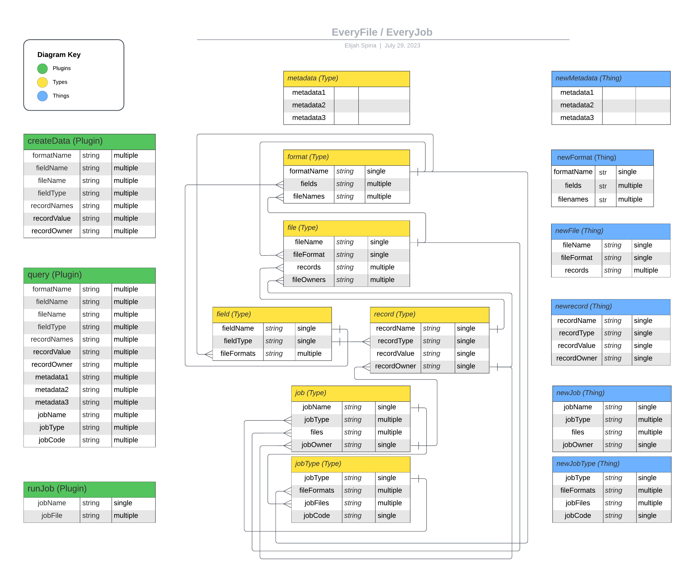

🚧 **_Under active development. Please use wisely._** 🚧

---

# Hyperfiles


Organize everything. Hyperfiles is a self-organizing universal knowledge graph. It was designed to support composable data exchange on open markets and data interoperability between applications or execution environments (e.g. blockchain virtual machines). Hyperfiles is built on the Near Blockchain Operating System (BOS) using [everything.dev](https://everything.dev) and currently only supports data types on Near. However, BOS is fundamentally chain agnostic and multi-chain composability is on the short-term roadmap.

**Quick Start**

1. [Create a new fileformat](https://everything.dev/flowscience.near/widget/create.fileFormat)
2. [Create a new file](https://everything.dev/flowscience.near/widget/create.file)

**Guides and Example Use Cases** (in progress)
- Guide: ["How to Create a New Fileformat"] - coming soon!
- Guide: ["How to Create a New File"] - coming soon!
- Guide: ["How to Use Attestations"] - coming soon!
- Use Case: ["Near Attestation Service"](https://near.social/flowscience.near/widget/NAS) - in progress!
- Use Case: ["Hypercerts on BOS" - demo](https://near.social/flowscience.near/widget/hypercert.page) ~ [Docs](https://github.com/open-cann/hypercerts-on-bos)
- Use Case: ["Scientific Fileformat Ontology (SFO)"] - coming soon!
- Guide: ["Hyperfiles Development Roadmap"] - coming soon!

---

### Standardized Type Schema
- The Hyperfiles knowledge graph is composed by reducing any piece of data or code into a set of unique objects, called `records`, which map to a set of pre-defined `fields`.
- Each set of `fields` composes into a unique `fileformat`. Likewise, each set of `records` composes into a unique `file`.
- `Files` are an indexed combination of `fields` and `records`.
- `Jobs` are a specific `fileformat` type that contain a set of instructions to run a Docker container using decentralized compute networks.



### Self-Assembling Data Structures
These features will be developed after a front-end that enables users to manually interact with the knowledge graph.

- [ ] Any data or job can be mixed and matched, enabling seamless composability across apps.
- [ ] Fileformats are automatically detected & categorized when new data is entered or when new fileformats are created during queries and jobs.
- [ ] Fields are analyzed to identify primitive types and basic statistics
- [ ] Core types & user-specific types?
- [ ] Marketplace price determination

---

### Components

**Integrated Frontend** - [In Progress](https://github.com/flowscience/hyperfiles/tree/master/widgets/plugins/hyperfiles.jsx)
- [ ] Publish (file/fileformat) - coming soon!
- [ ] Explore - coming soon!
- [ ] Profile - coming soon!

**Top-Level Plugins**: These are the main components used to interact with the entire Hyperfiles knowledge graph.
- `newFile`: create a new file via upload, manual input, and queries - [MVP Complete!](https://everything.dev/flowscience.near/widget/create.file)
- `query`: find any set of things, then mix and match - coming soon!
- `newJob`: create a new job file and execute a tool config - coming soon!

**Mid-Level Plugins**: These components can be used by developers to create new use cases for Hyperfiles.
- `create.fileformat`: create a new fileformat thing (should fileformats have owners?) - [MVP Complete!](https://everything.dev/flowscience.near/widget/create.fileFormat)
- `create.record`: create a new record thing - [MVP Complete!](https://everything.dev/flowscience.near/widget/create.record)

**Backend Plugins**: These component(s) are used by the top-level and mid-level plugins and likely won't need to be modified when integrating or using Hyperfiles.
- `create.field`: create a new field thing - [MVP Complete!](https://everything.dev/flowscience.near/widget/create.field)

**Core Types**
1. [field](https://github.com/flowscience/hyperfiles/blob/master/types/core_types/field.json)
2. [record](https://github.com/flowscience/hyperfiles/blob/master/types/core_types/record.json)
3. [fileformat](https://github.com/flowscience/hyperfiles/blob/master/types/core_types/fileformat.json)
4. [file](https://github.com/flowscience/hyperfiles/blob/master/types/core_types/file.json)
5. [metadata](https://github.com/flowscience/hyperfiles/blob/master/types/core_types/metadata.json) - needs update!

---

**To Do**
- [ ] Enable upload if file matches a template. Otherwise, use input fields.
- [ ] Fileformat by creating an array of fields and checking if fields exist, then check if that combination of fields exists
- [ ] Create unique IDs for each unique Thing (start with core types)
- [ ] create.field (xN) → create.fileFormat (x0-1) → create.record (xN) → create.file (x1)
- [ ] Enable using queries to create new files
- [ ] Index [EAS](https://attest.sh/) & enable cross-minting

---

🧬 Built by [flowscience](https://github.com/flowscience).  [No rights reserved](https://github.com/flowscience/hyperfiles/blob/master/LICENSE).

---


## Getting Started 

```
npm install
```

Then, run the command:

```
npm run dev
```

This will serve the widgets from `http://127.0.0.1:4040/`.

Go to [everything.dev/flags](https://everything.dev) and paste this value there.

Once set, see the locally served app at [hyperfiles.near/widget/app](https://everything.dev/hyperfiles.near/widget/app).

